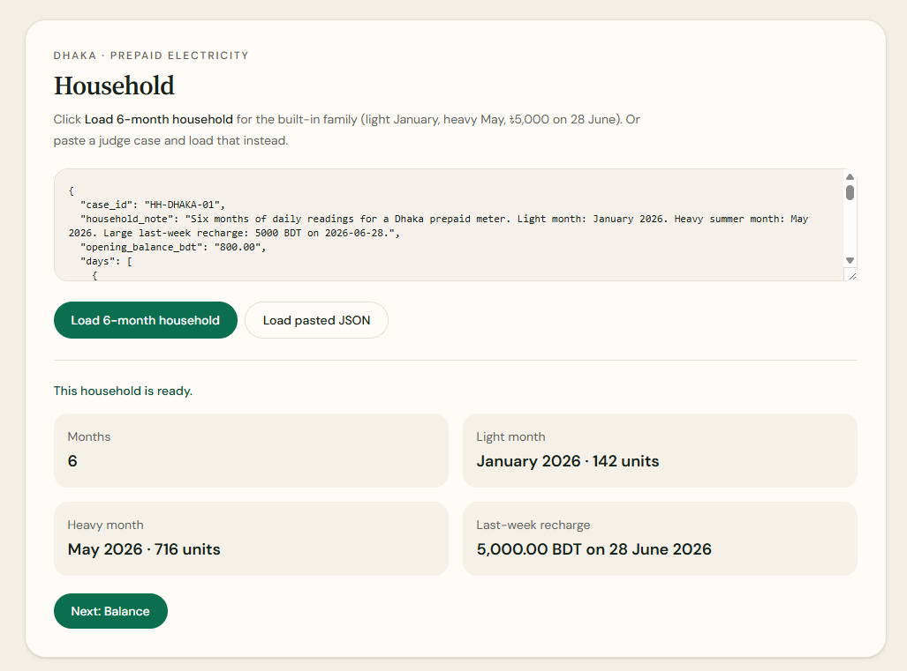
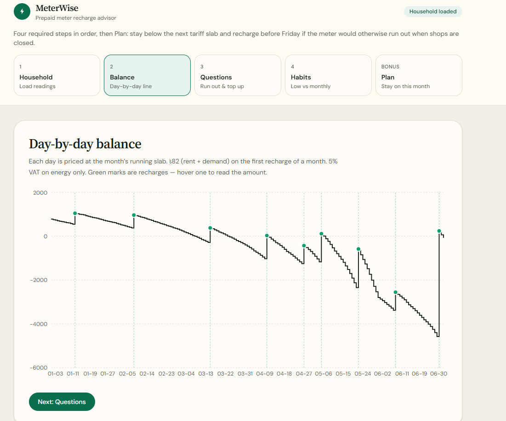
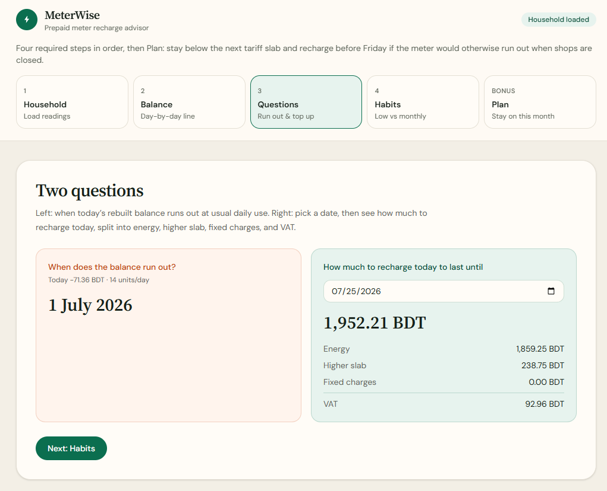
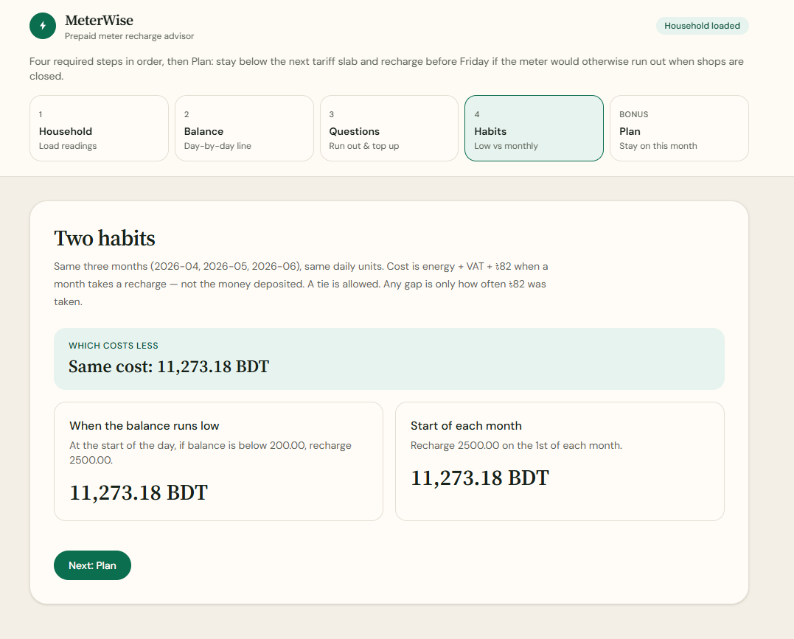

# MeterWise — Prepaid Meter Recharge Advisor

LofiStack Hackathon 2026

| | |
|---|---|
| **Team ID** | `lsh26-t044` |
| **Problem ID** | `p10` |
| **Live URL** | https://p1-nine-kappa.vercel.app/ |
| **Public repository** | https://github.com/mdkamrulislamdev/lsh26-t044-p10 |
| **Commit SHA** | After you push, run `git rev-parse HEAD` and paste the **full 40-character** hash on the form. Do not paste `main` or a short SHA. |

Four required tabs, in order: **Household → Balance → Questions → Habits**. Bonus: **Plan** (slab headroom and Friday–Saturday shop-closure recharge).

Third-party licenses: [`LICENSES.md`](./LICENSES.md). Application license: [`LICENSE`](./LICENSE) (MIT). How the engine works: [`architecture.md`](./architecture.md). Event fields: [`EVENT.md`](./EVENT.md). Judge pack: [`evaluation-manifest.json`](./evaluation-manifest.json).

**Demo video:** _add the ≤ 60 second link here after upload._

---

## Setup and run

Node.js 20+ and npm.

```bash
npm install
npm run dev
```

Open the URL Vite prints (usually `http://localhost:5173`). Judges should use the **Live URL** above — no install.

```bash
npm run build
npm run preview
npm test
```

`npm test` (same as `npm run test:engine`) prints every unit check and every public case as PASS or FAIL, then an overall summary. It also writes `docs/test_report.json` (gitignored). The fixture `docs/P10_prepaid_meter_public.json` must be on disk (copy from the problem pack). The live app ships `src/data/household.json` and does not need that file to run.

---

## How we approached the problem

We put every taka amount in one browser engine (`src/billingEngine.ts`) and let the UI only display it. The four required items are four tabs in the same order as the problem. Dates stay `YYYY-MM-DD` strings so the 1st of the month does not shift. Cost for habits is energy + VAT + ৳82, never the money deposited (R-33). Both habits use the same daily units (R-16).

---

## Proof each required item is met

### 1. Household (six months of readings)

**Load 6-month household** loads `HH-DHAKA-01`: January–June 2026 daily units, light January, heavy May, ৳5,000 on 28 June (last week of the month). The screen then shows month count, light month, heavy month, and last-week recharge. You can also paste a judge case.



### 2. Balance (day-by-day rebuild)

**Balance** draws a line of rebuilt meter balance. Each day: units at the month’s running slab, ৳82 (rent 40 + demand 42) on the **first recharge of that calendar month**, 5% VAT on **energy only**. Green marks are recharges; hover for date and amount. A recharge does not reset the slab.



### 3. Questions (run out + recharge today)

**Questions** uses today’s rebuilt balance and usual daily use for the run-out date. Pick a date for how much to recharge **today**, split into energy, higher slab, fixed charges, and VAT. ৳82 appears only if this calendar month has not already taken rent+demand. Later months on that one top-up do not add extra ৳82.



### 4. Habits (low balance vs start of month)

**Habits** runs the same three months and the same daily units. Low balance: top up at the **start of the day** if balance is **below** the threshold. Monthly: top up on the **1st**. Cost is billed energy + VAT + ৳82s, not deposits. The banner shows which costs less and by how much, or a **tie**.



Clarifications: **R-16** (no energy-rate saving from timing; difference is only ৳82 counts; ties allowed) and **R-33** (cost ≠ deposit; opening balance and months from `comparison`).

### Bonus. Plan (stay on this month)

**Plan** is extra, not one of the four scored items. It shows how many units remain in this month’s tariff slab (so the family can avoid jumping to a more expensive rate) and, if run-out falls on Friday or Saturday, the Thursday recharge amount that lasts through Sunday when many shops are closed. **Download family plan PDF** saves a one-page cream-and-green PDF on the device — nothing is uploaded.

---

## Major decisions

1. Browser-only engine so the live URL needs no server.
2. Four required tabs in problem order, plus a labelled Plan bonus.
3. Cost is never the deposit amount.
4. String dates and two-decimal taka so the 1st and paisa stay stable.
5. Tests against the 25 public cases so R-16 / R-33 hold beyond the built-in household.
6. A stay-on Plan tab so a family can avoid the next slab and avoid a Friday blackout.

---

## Known limitations

- No live DESCO/NESCO meter API.
- Rates are the problem’s table, not a live circular lookup.
- A `{ "cases": [...] }` paste uses the **first** case only.
- Refreshing the page clears the loaded household (no login, no database).
- “Higher slab” is energy minus (units × 4.63), not a separate billed fee.
- Demo video link is filled when the recording is uploaded.
- Family plan download is a local one-page PDF; it is not emailed or stored remotely.

Empty or invalid JSON shows an error and does not crash. Other tabs send you back to Household if nothing is loaded.

---

## Registered members — major contributions

| Member | Contribution |
|---|---|
| Kamrul (`mdkamrulislamdev`) | Product: four-tab UI, household JSON, billing engine (slabs, simulation, predictions, habits), stay-on Plan bonus, tests, README / licenses / architecture / evaluation-manifest, live deploy |

Add other registered members here if the arena lists more than one.

---

## Tech

React 19, TypeScript, Vite, Tailwind CSS v4, Recharts. See [`LICENSES.md`](./LICENSES.md).
