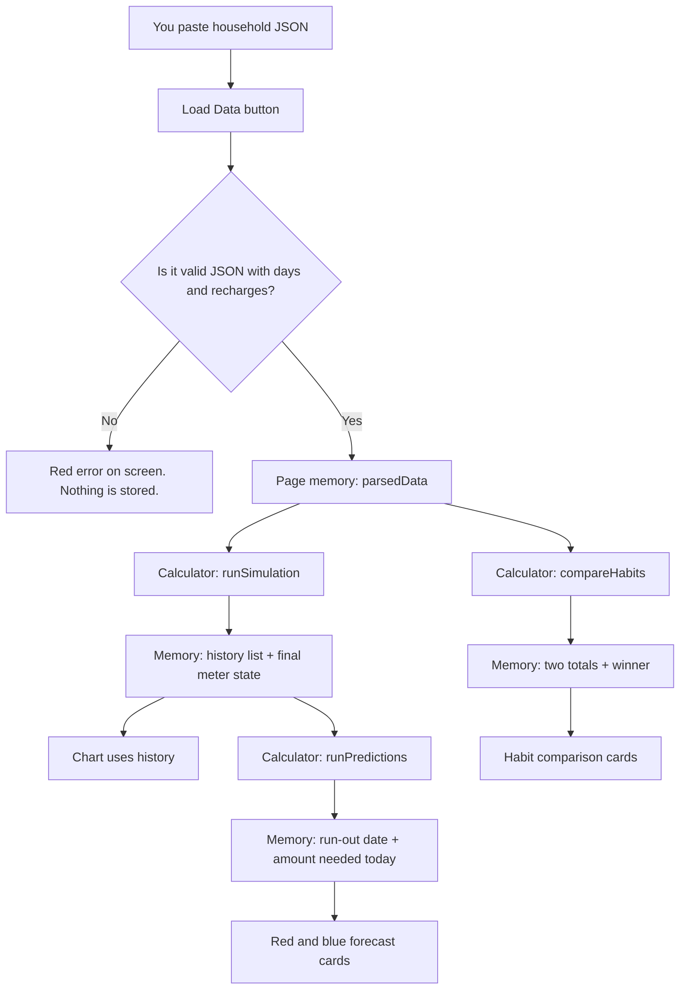

# Architecture — Meter Advisor (P10)

This note explains **how the product thinks**, not just where the files sit. It is written so a household member, a teammate, or a judge can follow it without needing to be a programmer.

If you only remember three things:

1. **You paste household meter data.** Nothing is fetched from DESCO’s live servers.
2. **All money math happens in one calculator** (`billingEngine`), not in the colourful cards on screen.
3. **Results live in the browser’s short-term memory.** Refresh the page and they disappear until you load the JSON again.

---

## 1. The real-world problem

A Dhaka family on a **prepaid electricity meter** pays before they use power. The display shows a balance in **taka (BDT)**. When it hits zero, the power can go off.

Two money rules make “when should we recharge?” harder than it looks:

- **Units get more expensive as the household uses more in the same calendar month** (tariff “slabs”). On the **1st of every month**, that counter starts again at the cheapest rate.
- **Meter rent (৳40) + demand charge (৳42) = ৳82** is taken on the **first recharge of each calendar month**. If you top up eight times in a panic, you can pay that ৳82 more often than a family that recharges once on the 1st.

The app answers four questions for one household case:

| Question | Where you see it |
|---|---|
| What did the balance do over time? | Balance History chart |
| When will it run out if we keep using power as usual? | Red forecast card |
| How much should we put in **today** to last until a target date? | Blue forecast card |
| Is “recharge when almost empty” more expensive than “recharge on the 1st”? | Habit comparison |

---

## 2. How we approached it

We split the work on purpose:

| Layer | Everyday analogy | Role |
|---|---|---|
| **Screen (UI)** | The shop counter | Paste data, show errors, draw the chart and cards |
| **Calculator (engine)** | The cashier who knows the price list | Apply slabs, VAT, rent, and month resets |

The screen is **not allowed** to invent taka amounts. If a number appears on a card, it came from the calculator.

We also refused to “guess” a daily cost (for example “units × 6”). That would look fine on a chart and still be **wrong advice** for a family. History, forecast, and habits all use the **same** rules.

---

## 3. What happens when you click Load Data

There is **no internet request to a meter company**. The “request” is: *the person on the computer asked the page to read this text*.

```text
You paste JSON  →  Load Data  →  Check the text is valid
        →  Remember the household case in the page
        →  Calculator rebuilds every past day
        →  Calculator looks into the future
        →  Calculator runs two “what if” recharge habits
        →  Screen draws chart + cards from those answers
```

Same flow as a diagram:



**Where calculation occurs:** only inside `src/billingEngine.ts`, in the browser, on your machine (or the judge’s machine when they open the live site).

**Where results are stored:** in **React state** — a notepad the page keeps until you close or refresh the tab.

| Name in the code | What a person would call it | Survives refresh? |
|---|---|---|
| `jsonInput` | The text still sitting in the box | Yes, until you clear it |
| `parsedData` | “We accepted this household case” | **No** if you refresh (unless you paste again) |
| `error` | Why Load Data failed | Until the next successful load |
| `simulation` | Day-by-day rebuilt ledger | Recalculated from `parsedData` |
| `predictions` | Future run-out + recharge-today | Recalculated from the ledger + `today` |
| `habitResult` | Low-balance vs monthly totals | Recalculated from the case |

There is **no database**, **no login**, and **no file written** when you use the website. The automated test runner is the only path that **writes a file** (`docs/test_report.json`), and that is for developers, not for families.

---

## 4. Inside the calculator (money rules)

Think of the meter as a **notebook that is updated once per day**, in date order.

### 4.1 Each past day (`runSimulation`)

For every date in `days`, in order:

1. **New calendar month?** Reset the “units used this month” counter to zero. Allow the ৳82 charge again (it only applies on the *first recharge of that month*).
2. **Any top-up that day?** Add the taka. If this is the first top-up this month, subtract **৳82**.
3. **Energy used that day?** Price those units using **slabs** (see below). Add **5% VAT on energy only** (not on the ৳82). Subtract from the balance.
4. **Write one line in the history:** date, balance (two decimal places), recharge amount if any, units, energy cost, VAT, whether ৳82 was taken.

That history list **is** the chart. Green dots are days where `rechargeAmount` is not empty.

### 4.2 Pricing one day’s units (`calculateEnergyCost`)

Electricity is not one price. Example: the household has already used **70 units** this month and uses **10 more** today.

- 5 units still sit in the cheap first slab (**৳4.63**)
- 5 units cross into the next slab (**৳5.26**)

We never multiply all 10 units by a single rate. We **slice** the day’s units across slab boundaries using the month-to-date counter.

On the **1st**, that counter is zero again, so the daily cost often **drops** even if the family uses the same number of units.

### 4.3 Looking forward (`runPredictions`)

Starting from the balance **after the last real reading** (`today`):

- Walk **tomorrow, then the next day…** (up to a year)
- Each day, assume `usual_daily_units`
- **Run-out date:** first day the balance would be ≤ 0
- **Amount needed today:** add up energy + VAT until `target_date`. The ৳82 is added **at most once**, on the first simulated day, and **only if** this month has not already taken a recharge. Future months in this “one big top-up today” story do **not** keep charging ৳82, because there are no extra recharges in that path.

### 4.4 Two habits, same electricity (`compareHabits`)

We take only the days that fall in the three comparison months. **Units used are identical** for both stories.

- **Low balance:** when the simulated balance would sit **below** `low_threshold_bdt`, add `low_amount_bdt`
- **1st of month:** on the 1st, add `monthly_amount_bdt`

Any **difference in total cost** should come from **how many times ৳82 is taken**, not from using more or less power.

---

## 5. How we keep the numbers trustworthy

Advice that is “almost right” is still bad for a family. We treat correctness as a product feature.

| Guard | Why it exists |
|---|---|
| Calculator separate from the screen | UI cannot round or “pretty up” a wrong total |
| Fixed price list in one place | Slabs, 5% VAT, ৳40 + ৳42 cannot drift between chart and cards |
| Dates as `YYYY-MM-DD` text | Avoids “1st of the month” landing on the previous day because of time zones |
| Money on the ledger stored with **two decimal places** | Matches how taka is shown |
| Load Data **try/catch** | Broken paste shows a red message; the page does not crash |
| **VAT only on energy** | ৳82 is never included in the 5% |
| **Automated tests** (`npm run test:engine`) | All public cases (PUB-01 … PUB-25) must pass the same rules |
| **Manual checklist** (`MANUAL_CHECKLIST.md`) | A human still checks tooltips, errors, and “does this feel right?” |

The test runner checks, among other things:

- Crossing the 75-unit and 200-unit slab lines
- VAT = 5% of energy
- On the 1st, the month unit counter equals **that day’s** units (reset worked)
- Chart recharge totals match the JSON `recharges` list
- ৳82 appears at most **once per calendar month** in history
- Habit cost difference is a **multiple of ৳82** (same energy, different fixed-charge count)

If a check fails, that case is marked **FAIL** in `docs/test_report.json`. We do not “average away” an error.

---

## 6. How we keep it fast

Families and judges should not wait. The design stays small on purpose.

| Choice | Effect |
|---|---|
| **Everything in the browser** | No waiting for a backend after Load Data |
| **One pass over the days** | A typical case is a few hundred days — instant on a laptop or phone |
| **`useMemo`** | Chart, forecast, and habits are **not** recalculated on every mouse move; only when the loaded case changes |
| **No live meter API** | Paste once; no polling, no loading spinner for the network |
| **Calculator is plain functions** | The same code runs in the page and in the test runner, quickly, 25 times |

We did **not** add a heavy server, database, or extra libraries for math. Speed here comes from **doing less work**, not from fancy infrastructure.

What is *not* optimised (and does not need to be for this problem): pasting a huge JSON into the text box is a bit clumsy; a case picker would be nicer later. The **math** is still cheap.

---

## 7. Map of the project (for people who want the file names)

```text
You / judge
    │
    ▼
src/App.tsx          Screen: paste, errors, layout, chart, cards
    │  calls
    ▼
src/billingEngine.ts  Only place taka are computed
    │
    ├── calculateEnergyCost   price today's units
    ├── runSimulation         rebuild the past
    ├── runPredictions        future run-out + recharge today
    └── compareHabits         low-balance vs 1st-of-month

test-runner.js        Same calculator, all public cases, writes docs/test_report.json
docs/P10_prepaid_meter_public.json   Official sample households
```

The screen uses React (buttons and layout) and Recharts (the line). Those libraries **draw**. They do **not** decide tariffs.

---

## 8. What this architecture deliberately does not do

- It does **not** log into DESCO or read a physical meter.
- It does **not** save your case in the cloud.
- It does **not** use live tariff circulars; rates are the **problem’s fixed list**.
- A full `{ "cases": [...] }` file uses **the first case** only (until a case picker is built).

Those limits keep the advice **repeatable**: same paste → same numbers → same tests.

---

## 9. Glossary

| Word | Plain meaning |
|---|---|
| JSON | A structured text format. Here: one household’s days, recharges, and settings |
| Slab | A price band: the next units this month cost more than the earlier ones |
| VAT | 5% tax, applied only on the energy portion |
| State | Information the page is currently holding in memory |
| Engine | The calculator module with the tariff rules |
| Simulation | Walking day by day as if we were the meter |

---

## 10. If you are checking our work

1. Paste a case → Load Data → chart, forecast, and habits should all appear together.
2. Hover a green dot → amount should match that date in `recharges`.
3. Run `npm run test:engine` → expect every case **SUCCESS**.
4. Read `MANUAL_CHECKLIST.md` for the remaining human checks (invalid paste, month-boundary run-out, ৳82 vs ৳0).

That is the whole path: **paste → check → calculate once → remember in the page → show. No hidden second calculator.**
